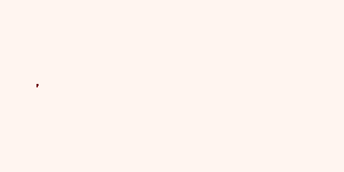

## `pompy` - *p*uff-based *o*dour plume *m*odel in *Py*thon

`pompy` is a NumPy based implementation of the puff-based odour plume model described in [*Filament-Based Atmospheric Dispersion Model to Achieve Short Time-Scale Structure of Odor Plumes*](http://link.springer.com/article/10.1023%2FA%3A1016283702837#page-1) by Farrell et al. (2002).



### What is this repository for?

This Python package allows simulation of dynamic 2D odour concentration fields which show some of the key characteristics of real chemical plumes in turbulent flows including short term intermittency, diffusive effects and longer term variations in spatial extent and location, while being significantly cheaper to run than a full fluid dynamics simulation.

### Installation and requirements

`pompy` was developed in Python 2.7. For basic usage of the models the two dependencies are NumPy and SciPy. For the demonstrations Matplotlib is also required. To install in the current Python environment run

```
python setup.py install
```

### Example usage

See also `pompy/demos.py` module. The below script will generate a 20 second MP4 animation (see above for GIF version) of a generated plume with model parameters consistent with those proposed in the Farrell et al. (2002) paper

```python
from pompy import models, processors
import numpy as np
import matplotlib.pyplot as plt
from matplotlib.animation import FuncAnimation

# Seed random number generator
seed = 20180517
rng = np.random.RandomState(seed)

# Define wind model parameters
wind_model_params = {
    'sim_region': models.Rectangle(0., -50., 100., 50.),
    'nx': 21,
    'ny': 21,
    'u_av': 1.,
    'v_av': 0.,
    'Kx': 2.,
    'Ky': 2.,
    'noise_gain': 20.,
    'noise_damp': 0.1,
    'noise_bandwidth': 0.2,
}

# Create wind model object
wind_model = models.WindModel(noise_rand=rng, **wind_model_params)

# Define plume simulation region
# This is a subset of the wind simulation region to minimise boundary effects
sim_region = models.Rectangle(0., -12.5, 50., 12.5)

# Define plume model parameters
plume_model_params = {
    'source_pos': (5., 0., 0.),
    'centre_rel_diff_scale': 2.,
    'puff_release_rate': 10,
    'puff_init_rad': 0.001**0.5,
    'puff_spread_rate': 0.001,
    'init_num_puffs': 10,
    'max_num_puffs': 1000,
    'model_z_disp': True,
}

# Create plume model object
plume_model = models.PlumeModel(
    prng=rng, sim_region=sim_region, wind_model=wind_model, 
    **plume_model_params)

# Define concentration array (image) generator parameters
array_gen_params = {
    'array_z': 0.,
    'nx': 500,
    'ny': 250,
    'puff_mol_amount': 8.3e8
}

# Create concentration array generator object
array_gen = processors.ConcentrationArrayGenerator(
    array_xy_region=sim_region, **array_gen_params)
    
# Set up figure
fig = plt.figure(figsize=(5, 2.5))
ax = fig.add_axes([0., 0., 1., 1.])
ax.axis('off')

# Display initial concentration field as image
conc_array = array_gen.generate_single_array(plume_model.puff_array)
im_extents = (sim_region.x_min, sim_region.x_max,
              sim_region.y_min, sim_region.y_max)
conc_im = ax.imshow(
    conc_array.T, extent=im_extents, vmin=0., vmax=1e10, cmap='Reds')

# Simulation timestep
dt = 0.01

# Define animation update function
def update(i):
    # Do 10 time steps per frame update
    for k in range(10):
        wind_model.update(dt)
        plume_model.update(dt)
    conc_array = array_gen.generate_single_array(plume_model.puff_array)
    conc_im.set_data(conc_array.T)
    return [conc_im]

# Animate plume concentration and save as MP4
anim = FuncAnimation(fig, update, frames=400, repeat=False)
anim.save('plume.mp4', dpi=100, fps=20, extra_args=['-vcodec', 'libx264'])
```
