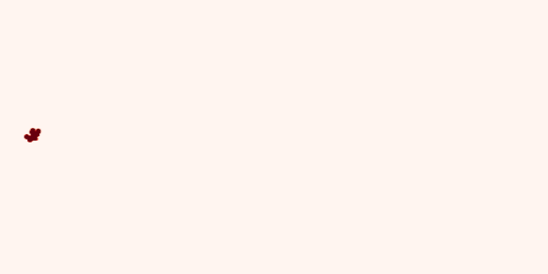

PomPy - puff-based odour plume model in Python
================================================

.. include:: description.rst

An example simulated concentration field generated by the package is shown below

API documentation
-----------------

.. toctree::
   :maxdepth: 2

   pompy.models.rst
   pompy.processors.rst
   pompy.demos.rst
